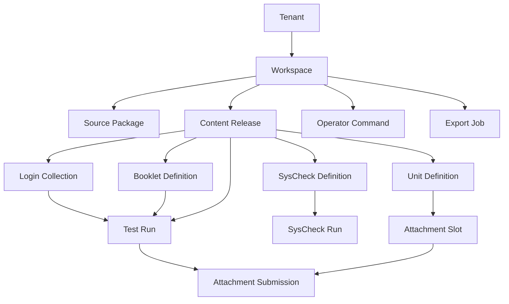

# Testcenter Rewrite Canonical Domain Model

## Purpose

This document defines the canonical domain model that the rewrite should use internally.

It is the layer between:

- incoming source artifacts such as XML
- transactional application behavior
- compiled runtime projections

The goal is to stop treating source XML as the runtime data model.

## Modeling Principles

- every primary aggregate is tenant-scoped
- every workspace-facing business object is workspace-scoped unless explicitly tenant-level
- source artifacts are immutable
- content releases are immutable
- runtime state is mutable but always linked to an immutable release
- business behavior should depend on canonical entities, not on raw XML parsing
- audits are append-only even when the current state is mutable

## Canonical Naming

To keep language precise, I recommend these terms:

- `source package`: uploaded XML and related files exactly as received
- `content release`: immutable canonicalized set of content active in a workspace
- `runtime projection`: compiled shape used by participant runtime or monitor views
- `booklet assignment`: a login-visible assignment of a booklet plus initial state overrides
- `run policy snapshot`: resolved execution rules captured when a run starts

## Identifier Strategy

The rewrite should use **two identifier layers**.

### 1. Internal Record IDs

Use ULIDs or UUIDs for immutable database identity:

- `tenant_id`
- `workspace_id`
- `content_release_id`
- `unit_definition_id`
- `booklet_definition_id`
- `login_collection_id`
- `syscheck_definition_id`
- `test_run_id`

These should never encode business meaning.

### 2. Stable Business Keys

Use normalized business keys to preserve domain semantics:

- `tenant_key`
- `workspace_key`
- `unit_key`
- `booklet_key`
- `resource_key`
- `player_key`
- `group_key`
- `login_key`
- `syscheck_key`

Business rules and import diagnostics should mostly talk in terms of business keys.

### Key Rule

Never overload one field to serve both as:

- database identity
- public identifier
- source compatibility key

The current system often blurs these together. The rewrite should not.

## Aggregate Overview

## 1. Tenant

Aggregate root:

- `Tenant`

Core fields:

- `tenant_id`
- `tenant_key`
- `display_name`
- `status`
- `created_at`
- `feature_flags`

Owns:

- tenant branding defaults
- tenant-level policies
- tenant-level admin boundaries

## 2. Workspace

Aggregate root:

- `Workspace`

Core fields:

- `workspace_id`
- `tenant_id`
- `workspace_key`
- `display_name`
- `status`
- `active_content_release_id`

Owns:

- content activation
- workspace-scoped settings
- workspace-scoped operators

Invariant:

- a workspace can point to exactly one active content release at a time

## 3. Admin User

Aggregate root:

- `AdminUser`

Core fields:

- `admin_user_id`
- `tenant_id` or platform scope
- `username`
- `password_hash`
- `status`
- `must_rotate_password`

Related value objects:

- `RoleAssignment`
- `AccessScope`

Invariant:

- platform admins are not the same thing as tenant admins

## 4. Source Package

Aggregate root:

- `SourcePackage`

Core fields:

- `source_package_id`
- `tenant_id`
- `workspace_id`
- `uploaded_by`
- `uploaded_at`
- `format`
- `storage_uri`
- `manifest_hash`

Owns:

- uploaded artifact list
- source metadata

Invariant:

- source packages are immutable once uploaded

## 5. Import Job

Aggregate root:

- `ImportJob`

Core fields:

- `import_job_id`
- `source_package_id`
- `status`
- `started_at`
- `finished_at`
- `summary`

Owns:

- validation outputs
- transformation outputs
- import trace

Invariant:

- one import job produces at most one content release

## 6. Content Release

Aggregate root:

- `ContentRelease`

Core fields:

- `content_release_id`
- `tenant_id`
- `workspace_id`
- `release_label`
- `source_package_id`
- `status`
- `created_at`
- `activated_at`

Owns:

- canonical units
- canonical booklets
- canonical players and resources
- canonical login collections
- canonical system checks

Invariant:

- a content release is immutable after creation

## 7. Unit Definition

Aggregate root:

- `UnitDefinition`

Core fields:

- `unit_definition_id`
- `content_release_id`
- `unit_key`
- `title`
- `player_asset_ref`
- `definition_payload_ref`
- `coding_scheme_ref`
- `metadata`

Child entities:

- `UnitDependency`
- `AttachmentSlotDefinition`

Invariant:

- a unit definition can reference one player asset and many resource assets

## 8. Player Asset

Aggregate root:

- `PlayerAsset`

Core fields:

- `player_asset_id`
- `content_release_id`
- `player_key`
- `api_major_version`
- `storage_uri`
- `hash`

Invariant:

- player compatibility should be checked at import time and surfaced at activation time

## 9. Resource Asset

Aggregate root:

- `ResourceAsset`

Core fields:

- `resource_asset_id`
- `content_release_id`
- `resource_key`
- `storage_uri`
- `resource_type`
- `hash`

## 10. Booklet Definition

Aggregate root:

- `BookletDefinition`

Core fields:

- `booklet_definition_id`
- `content_release_id`
- `booklet_key`
- `title`
- `runtime_config`
- `state_model`
- `metadata`

Child entities:

- `BookletNode`
- `BookletSection`
- `BookletUnitRef`
- `BookletState`
- `BookletStateOption`
- `AdaptivityRule`

Invariant:

- every booklet unit reference must resolve to a unit definition in the same content release

## 11. Login Collection

Aggregate root:

- `LoginCollection`

Core fields:

- `login_collection_id`
- `content_release_id`
- `collection_key`
- `source_artifact_ref`

Child entities:

- `GroupDefinition`
- `ParticipantLoginDefinition`
- `MonitorProfileDefinition`

Invariant:

- a login collection can only reference booklets from the same content release

## 12. Group Definition

Entity inside `LoginCollection`:

- `group_key`
- `display_label`
- `valid_from`
- `valid_to`
- `valid_for_minutes`

## 13. Participant Login Definition

Entity inside `LoginCollection`:

- `login_key`
- `group_key`
- `mode_key`
- `password_policy`
- `custom_text_overrides`
- `view_settings`

Child entities:

- `BookletAssignment`
- `AccessProfileRef`

### Important Modeling Choice

A participant login should not point directly to a booklet only.

It should point to one or more `BookletAssignment` entities:

- `assignment_key`
- `booklet_key`
- `required_code` or code-group
- `initial_state_overrides`

This preserves the current legacy semantics where a “test” may mean:

- booklet `X`
- plus state values such as `stateA:option2`

## 14. System Check Definition

Aggregate root:

- `SysCheckDefinition`

Core fields:

- `syscheck_definition_id`
- `content_release_id`
- `syscheck_key`
- `title`
- `description`
- `save_key`
- `skip_network`

Child entities:

- `SysCheckQuestion`
- `SpeedPolicy`
- `EmbeddedUnitRef`
- `CustomTextOverride`

Invariant:

- if a system check embeds a unit, the unit must exist in the same content release

## 15. Branding Profile

Aggregate root:

- `BrandingProfile`

Core fields:

- `branding_profile_id`
- `tenant_id`
- optional `workspace_id`
- `app_title`
- `logo_uri`
- `intro_html`
- `legal_notice_html`
- `theme_key`

Invariant:

- workspace-level branding overrides tenant-level branding only where explicitly set

## 16. Text Bundle

Aggregate root:

- `TextBundle`

Core fields:

- `text_bundle_id`
- `tenant_id`
- optional `workspace_id`
- `scope`
- `entries`

Scopes:

- tenant default
- workspace override
- login override
- sys-check override
- booklet override

## 17. Test Run

Aggregate root:

- `TestRun`

Core fields:

- `test_run_id`
- `tenant_id`
- `workspace_id`
- `content_release_id`
- `group_key`
- `login_key`
- `assignment_key`
- `mode_key`
- `status`
- `started_at`
- `ended_at`

Child entities:

- `RunPolicySnapshot`
- `UnitAttempt`
- `RunCommandInbox`

Invariant:

- a run always binds to one immutable content release and one resolved policy snapshot

## 18. Run Policy Snapshot

Entity inside `TestRun`:

- resolved mode capabilities
- resolved booklet runtime config
- resolved branding/text settings relevant to the run
- compatibility decisions

This is important because it freezes runtime behavior even if later settings or content change.

## 19. Unit Attempt

Entity inside `TestRun`:

- `unit_attempt_id`
- `unit_key`
- `booklet_node_ref`
- `visit_state`
- `current_page`
- `entered_at`
- `left_at`

Child entities:

- `ResponseSnapshot`
- `UnitStateSnapshot`

## 20. Review Entry

Aggregate root:

- `ReviewEntry`

Core fields:

- `review_entry_id`
- `tenant_id`
- `workspace_id`
- `test_run_id`
- optional `unit_key`
- `author_ref`
- `priority`
- `categories`
- `entry_text`
- `created_at`
- `updated_at`

## 21. Attachment Slot

Aggregate root:

- `AttachmentSlot`

Core fields:

- `attachment_slot_id`
- `tenant_id`
- `workspace_id`
- `content_release_id`
- `unit_key`
- `variable_key`
- `attachment_type`

This is derived from content, but becomes operationally relevant once runs exist.

## 22. Attachment Submission

Aggregate root:

- `AttachmentSubmission`

Core fields:

- `attachment_submission_id`
- `tenant_id`
- `workspace_id`
- `test_run_id`
- `attachment_slot_id`
- `submitted_at`
- `submitted_by`

Child entities:

- `AttachmentAssetRef`

## 23. System Check Run

Aggregate root:

- `SysCheckRun`

Core fields:

- `syscheck_run_id`
- `tenant_id`
- `workspace_id`
- `content_release_id`
- `syscheck_key`
- optional `login_key`
- `status`
- `started_at`
- `submitted_at`

Child entities:

- `QuestionAnswer`
- `NetworkResult`
- `EmbeddedUnitResult`

## 24. Operator Command

Aggregate root:

- `OperatorCommand`

Core fields:

- `operator_command_id`
- `tenant_id`
- `workspace_id`
- `issued_by`
- `command_type`
- `target_selector`
- `issued_at`
- `status`

Child entities:

- `CommandTarget`
- `CommandAck`

## 25. Export Job

Aggregate root:

- `ExportJob`

Core fields:

- `export_job_id`
- `tenant_id`
- `workspace_id`
- `requested_by`
- `export_type`
- `selection`
- `status`
- `storage_uri`
- `created_at`

## Aggregate Relationships

## Versioning Rules

### Source Artifacts

- immutable
- never overwritten
- new upload means new source package

### Content Releases

- immutable
- derived from exactly one canonicalization run
- can be activated or superseded, but not edited in place

### Branding And Text Configuration

- version every change
- keep a current pointer plus history
- allow preview before activation where practical

### Runtime State

- mutable
- always references immutable content release and policy snapshot

### Exports

- generated artifacts should record:
  - source workspace
  - content release reference if relevant
  - selection criteria
  - generation timestamp

## Domain Events

The rewrite should use append-only domain and operational events, but it does not need full event sourcing.

### Platform Events

- `TenantCreated`
- `TenantSuspended`
- `WorkspaceCreated`
- `WorkspaceArchived`

### Import Events

- `SourcePackageUploaded`
- `ImportJobStarted`
- `ImportValidationCompleted`
- `ContentCanonicalized`
- `ContentReleaseCreated`
- `ContentReleaseActivated`

### Identity Events

- `AdminAuthenticated`
- `ParticipantAuthenticated`
- `PasswordResetRequested`
- `PasswordRotated`
- `SessionInvalidated`

### Runtime Events

- `TestRunStarted`
- `UnitEntered`
- `ResponseSaved`
- `UnitStateSaved`
- `RunPaused`
- `RunResumed`
- `RunTerminated`
- `AdaptiveTransitionApplied`
- `ConnectionLostReported`

### Monitoring Events

- `MonitorProfileApplied`
- `OperatorCommandIssued`
- `OperatorCommandDelivered`
- `OperatorCommandAcknowledged`

### Review Events

- `ReviewCreated`
- `ReviewUpdated`
- `ReviewDeleted`

### Attachment Events

- `AttachmentPageBatchGenerated`
- `AttachmentSubmitted`
- `AttachmentDeleted`

### System Check Events

- `SysCheckRunStarted`
- `SysCheckQuestionAnswered`
- `SysCheckReportSubmitted`

### Export Events

- `ExportRequested`
- `ExportGenerated`
- `ExportDownloaded`

## Storage Mapping

## Relational Storage

Use tables for:

- tenants
- workspaces
- admin users and sessions
- source package metadata
- import jobs and validation reports
- content release metadata
- canonical entity metadata
- runtime state
- monitor projections
- review entries
- command history
- export jobs
- audits

### Suggested Pattern

For large canonical entities, store:

- structured searchable metadata in relational tables
- full normalized payload or compiled JSON in JSONB columns if helpful

Do not force every nested content concept into a separate table if that makes import and runtime resolution harder than necessary.

## Object Storage

Use object storage for:

- uploaded XML and artifacts
- player packages
- resource files
- generated exports
- attachment images/files
- generated PDFs

Suggested path convention:

- `tenant/{tenant_key}/workspace/{workspace_key}/source/{source_package_id}/...`
- `tenant/{tenant_key}/workspace/{workspace_key}/release/{content_release_id}/assets/...`
- `tenant/{tenant_key}/workspace/{workspace_key}/exports/{export_job_id}/...`
- `tenant/{tenant_key}/workspace/{workspace_key}/attachments/{attachment_submission_id}/...`

## Runtime Projections

Use explicit compiled projections for:

- participant starter cards
- test launch bundle
- monitor session rows
- study monitor summaries
- attachment page generation inputs
- system-check execution bundle

These are derived and rebuildable.

## Core Invariants To Enforce

- every canonical entity belongs to one content release
- every content release belongs to one workspace and one tenant
- every run points to one assignment and one content release
- every assignment references one booklet and optional initial state overrides
- every attachment slot maps to one unit variable in a content release
- every system-check definition references only in-release entities
- every command target belongs to the same tenant and authorized scope
- every export selection stays within one tenant and authorized scope

## Compatibility Layer Rules

The compatibility layer should be responsible for:

- reading XML
- validating XML syntax and schema
- mapping source identifiers to canonical keys
- translating source-specific concepts into canonical value objects

The compatibility layer should **not** be responsible for:

- runtime policy enforcement
- participant session state
- monitoring behavior
- export generation semantics

Those belong to the canonical business model.

## Recommended Next Design Step

The next useful artifact is a concrete module map from this domain model into:

- application services
- API endpoints
- database tables and projections
- background jobs
- acceptance suites
