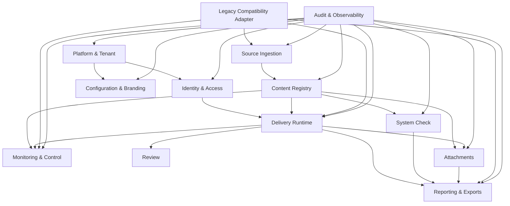

# Testcenter Rewrite Module Map

## Purpose

This document converts the canonical domain model into implementation-facing modules.

It answers:

- what modules exist
- what each module owns
- what application services each module exposes
- what API families should exist
- what tables and projections each module writes
- what background jobs exist
- what acceptance suites verify the module

This is the bridge from architecture to ticket-ready implementation.

## Assumptions

This module map is aligned with:

- [rewrite-feature-matrix.md](/Users/julian/Documents/Codex/2026-04-21-https-github-com-iqb-berlin-testcenter/rewrite-feature-matrix.md)
- [rewrite-target-architecture.md](/Users/julian/Documents/Codex/2026-04-21-https-github-com-iqb-berlin-testcenter/rewrite-target-architecture.md)
- [rewrite-implementation-roadmap.md](/Users/julian/Documents/Codex/2026-04-21-https-github-com-iqb-berlin-testcenter/rewrite-implementation-roadmap.md)
- [rewrite-canonical-domain-model.md](/Users/julian/Documents/Codex/2026-04-21-https-github-com-iqb-berlin-testcenter/rewrite-canonical-domain-model.md)

## Recommended Deployable Shape

### Deployables

1. `web`
   - participant UI
   - operations UI
   - admin UI
2. `api`
   - synchronous application services
   - auth/session handling
   - runtime APIs
   - admin APIs
   - realtime gateway
3. `worker`
   - import jobs
   - export jobs
   - generated artifact jobs
   - projection rebuild jobs

### Shared Infrastructure

- relational DB
- object storage
- optional cache/pubsub
- audit/log/metrics pipeline

## Module Dependency Direction

## Module Catalog

## 1. Platform And Tenant Module

### Owns

- `Tenant`
- `Workspace`
- platform admin boundaries
- tenant lifecycle

### Application Services

- `CreateTenant`
- `SuspendTenant`
- `RenameTenant`
- `CreateWorkspace`
- `ArchiveWorkspace`
- `SetWorkspaceActiveRelease`
- `ListTenantWorkspaces`

### API Families

- `POST /api/v1/platform/tenants`
- `PATCH /api/v1/platform/tenants/{tenantKey}`
- `GET /api/v1/platform/tenants`
- `POST /api/v1/tenants/{tenantKey}/workspaces`
- `PATCH /api/v1/tenants/{tenantKey}/workspaces/{workspaceKey}`
- `GET /api/v1/tenants/{tenantKey}/workspaces`

### Write Tables

- `tenants`
- `tenant_domains`
- `workspaces`
- `workspace_status_history`

### Read Projections

- `tenant_admin_workspace_list_v`
- `platform_tenant_summary_v`

### Jobs

- `rebuild_workspace_summary`

### Acceptance Suites

- `TEN-01 platform tenant lifecycle`
- `TEN-02 workspace lifecycle`
- `TEN-03 tenant isolation smoke`

## 2. Identity And Access Module

### Owns

- admin auth
- participant login
- auth sessions
- role assignments
- password rotation/reset
- rate limiting / brute-force policy

### Application Services

- `AdminSignIn`
- `AdminSignOut`
- `ParticipantSignIn`
- `ParticipantContinueCodeStep`
- `GetCurrentSession`
- `InvalidateSession`
- `ResetAdminPassword`
- `RotateOwnPassword`
- `AssignRole`
- `RemoveRole`

### API Families

- `POST /api/v1/admin/auth/sign-in`
- `POST /api/v1/admin/auth/sign-out`
- `POST /api/v1/participant/auth/sign-in`
- `POST /api/v1/participant/auth/continue`
- `GET /api/v1/sessions/current`
- `DELETE /api/v1/sessions/current`
- `POST /api/v1/admin/users/{userId}/password-reset`
- `POST /api/v1/admin/users/{userId}/roles`

### Write Tables

- `admin_users`
- `admin_password_credentials`
- `admin_role_assignments`
- `auth_sessions`
- `participant_login_attempts`
- `security_locks`

### Read Projections

- `current_session_v`
- `admin_user_access_v`

### Jobs

- `expire_auth_sessions`
- `clear_security_locks`

### Acceptance Suites

- `AUTH-01 admin auth`
- `AUTH-02 participant login variants`
- `AUTH-03 code-step login`
- `AUTH-04 brute-force protection`
- `AUTH-05 forced password rotation`

## 3. Source Ingestion Module

### Owns

- source package intake
- raw artifact metadata
- import orchestration
- validation messaging

### Application Services

- `UploadSourcePackage`
- `StartImportJob`
- `GetImportStatus`
- `CancelImportJob`
- `ListImportMessages`

### API Families

- `POST /api/v1/workspaces/{workspaceKey}/imports/source-packages`
- `POST /api/v1/workspaces/{workspaceKey}/imports`
- `GET /api/v1/workspaces/{workspaceKey}/imports/{importJobId}`
- `GET /api/v1/workspaces/{workspaceKey}/imports/{importJobId}/messages`
- `DELETE /api/v1/workspaces/{workspaceKey}/imports/{importJobId}`

### Write Tables

- `source_packages`
- `source_artifacts`
- `import_jobs`
- `import_messages`
- `import_traces`

### Read Projections

- `workspace_import_history_v`
- `latest_import_status_v`

### Jobs

- `ingest_source_package`
- `validate_source_package`
- `cross_validate_source_package`

### Acceptance Suites

- `IMP-01 valid import`
- `IMP-02 invalid schema`
- `IMP-03 cross-file validation`
- `IMP-04 duplicate id detection`

## 4. Content Registry Module

### Owns

- canonical content graph
- immutable content releases
- canonical relationships
- compiled runtime bundles

### Application Services

- `CreateContentRelease`
- `ActivateContentRelease`
- `ListContentReleases`
- `GetContentReleaseDiff`
- `GetContentDependencyGraph`
- `CompileRuntimeBundle`

### API Families

- `GET /api/v1/workspaces/{workspaceKey}/content-releases`
- `POST /api/v1/workspaces/{workspaceKey}/content-releases/{contentReleaseId}/activate`
- `GET /api/v1/workspaces/{workspaceKey}/content-releases/{contentReleaseId}`
- `GET /api/v1/workspaces/{workspaceKey}/content-releases/{contentReleaseId}/dependencies`
- `GET /api/v1/workspaces/{workspaceKey}/content-releases/{contentReleaseId}/diff/{otherReleaseId}`

### Write Tables

- `content_releases`
- `unit_definitions`
- `player_assets`
- `resource_assets`
- `booklet_definitions`
- `booklet_nodes`
- `booklet_state_options`
- `login_collections`
- `group_definitions`
- `participant_login_definitions`
- `booklet_assignments`
- `monitor_profile_definitions`
- `syscheck_definitions`
- `syscheck_questions`
- `attachment_slot_definitions`
- `content_relationships`
- `compiled_runtime_bundles`

### Read Projections

- `workspace_active_release_v`
- `content_release_summary_v`
- `content_dependency_graph_v`

### Jobs

- `canonicalize_source_package`
- `build_content_release`
- `build_runtime_bundles`
- `diff_content_releases`

### Acceptance Suites

- `CNT-01 canonical release creation`
- `CNT-02 booklet-unit-player-resource graph`
- `CNT-03 login assignment semantics`
- `CNT-04 sys-check definition mapping`
- `CNT-05 attachment slot mapping`

## 5. Participant Access And Starter Module

### Owns

- starter decisions
- available booklet/system-check cards
- direct-link auto-dispatch
- run launch entry

### Application Services

- `ResolveStarterView`
- `AutoDispatchSingleAccessTarget`
- `StartAssignedRun`
- `ResumeAssignedRun`
- `ListAvailableSysChecks`

### API Families

- `GET /api/v1/participant/starter`
- `POST /api/v1/participant/starter/dispatch`
- `POST /api/v1/participant/runs`
- `POST /api/v1/participant/runs/{runId}/resume`

### Write Tables

- `participant_dispatch_history`
- `test_runs`

### Read Projections

- `participant_starter_cards_v`
- `participant_available_syschecks_v`

### Jobs

- none required initially

### Acceptance Suites

- `STA-01 starter with one booklet`
- `STA-02 starter with multiple booklets`
- `STA-03 direct-link login`
- `STA-04 system-check auto-dispatch`

## 6. Delivery Runtime Module

### Owns

- run lifecycle
- mode engine
- policy snapshot
- unit state
- response persistence
- navigation and timing decisions
- adaptivity

### Application Services

- `LaunchRun`
- `GetRunShell`
- `GetUnitPayload`
- `SaveResponses`
- `SaveUnitState`
- `SaveRunState`
- `AcknowledgeCommand`
- `TerminateRun`
- `ReportConnectionLost`

### API Families

- `GET /api/v1/runs/{runId}`
- `GET /api/v1/runs/{runId}/units/{unitKey}`
- `PUT /api/v1/runs/{runId}/units/{unitKey}/responses`
- `PATCH /api/v1/runs/{runId}/units/{unitKey}/state`
- `PATCH /api/v1/runs/{runId}/state`
- `GET /api/v1/runs/{runId}/commands`
- `PATCH /api/v1/runs/{runId}/commands/{commandId}/ack`
- `POST /api/v1/runs/{runId}/connection-lost`
- `POST /api/v1/runs/{runId}/terminate`

### Write Tables

- `test_runs`
- `run_policy_snapshots`
- `unit_attempts`
- `response_snapshots`
- `unit_state_snapshots`
- `run_state_snapshots`
- `run_command_inbox`
- `run_command_acknowledgements`
- `runtime_events`

### Read Projections

- `run_shell_v`
- `unit_runtime_payload_v`
- `run_command_inbox_v`

### Jobs

- `compact_runtime_state`
- `rebuild_run_projection`

### Acceptance Suites

- `RT-01 login and launch`
- `RT-02 hot-return`
- `RT-03 hot-restart`
- `RT-04 time restrictions`
- `RT-05 unlock code flow`
- `RT-06 response completion lock`
- `RT-07 presentation completion lock`
- `RT-08 leave/lock semantics`
- `RT-09 adaptivity`
- `RT-10 booklet config options`

## 7. Monitoring And Control Module

### Owns

- realtime feed
- group monitor views
- study monitor views
- monitor profiles and filters
- command dispatch and acknowledgement

### Application Services

- `ConnectMonitorChannel`
- `ListGroupSessions`
- `ApplyMonitorProfile`
- `CreateMonitorFilter`
- `DispatchOperatorCommand`
- `GetStudySummary`

### API Families

- `GET /api/v1/monitor/groups/{groupKey}/sessions`
- `GET /api/v1/monitor/groups/{groupKey}/profiles/{profileKey}`
- `POST /api/v1/monitor/groups/{groupKey}/filters`
- `POST /api/v1/monitor/commands`
- `GET /api/v1/study-monitor/workspaces/{workspaceKey}`
- `GET /api/v1/realtime/connect`

### Write Tables

- `monitor_profiles`
- `monitor_filters`
- `operator_commands`
- `operator_command_targets`
- `operator_command_acks`
- `monitor_session_projection`
- `study_monitor_projection`

### Read Projections

- `monitor_group_sessions_v`
- `monitor_profile_view_v`
- `study_monitor_workspace_summary_v`

### Jobs

- `refresh_monitor_projection`
- `refresh_study_monitor_projection`
- `fanout_operator_command`

### Acceptance Suites

- `MON-01 monitor session visibility`
- `MON-02 monitor profiles`
- `MON-03 monitor filters`
- `MON-04 pause resume goto terminate unlock`
- `MON-05 degraded transport fallback`

## 8. Review Module

### Owns

- review creation
- unit/test-level reviews
- review edit/delete
- review read models

### Application Services

- `CreateReview`
- `UpdateReview`
- `DeleteReview`
- `ListRunReviews`
- `ListUnitReviews`

### API Families

- `POST /api/v1/runs/{runId}/reviews`
- `POST /api/v1/runs/{runId}/units/{unitKey}/reviews`
- `PATCH /api/v1/reviews/{reviewId}`
- `DELETE /api/v1/reviews/{reviewId}`
- `GET /api/v1/runs/{runId}/reviews`
- `GET /api/v1/runs/{runId}/units/{unitKey}/reviews`

### Write Tables

- `review_entries`
- `review_categories`

### Read Projections

- `run_reviews_v`
- `unit_reviews_v`

### Jobs

- `rebuild_review_export_projection`

### Acceptance Suites

- `REV-01 create review`
- `REV-02 unit and run review separation`
- `REV-03 edit and delete review`

## 9. Reporting And Exports Module

### Owns

- export requests
- export generation
- detailed result inspection
- deletion workflows

### Application Services

- `RequestExport`
- `GetExportStatus`
- `DownloadExport`
- `GetWorkspaceResultSummary`
- `DeleteGroupResults`
- `GetDetailedResponses`

### API Families

- `POST /api/v1/workspaces/{workspaceKey}/exports`
- `GET /api/v1/workspaces/{workspaceKey}/exports/{exportJobId}`
- `GET /api/v1/workspaces/{workspaceKey}/exports/{exportJobId}/download`
- `GET /api/v1/workspaces/{workspaceKey}/results`
- `GET /api/v1/workspaces/{workspaceKey}/results/detailed`
- `DELETE /api/v1/workspaces/{workspaceKey}/results`

### Write Tables

- `export_jobs`
- `export_artifacts`
- `result_deletion_requests`
- `result_deletion_audit`

### Read Projections

- `workspace_result_summary_v`
- `workspace_detailed_responses_v`

### Jobs

- `generate_response_export`
- `generate_log_export`
- `generate_review_export`
- `generate_syscheck_export`
- `delete_group_results`

### Acceptance Suites

- `EXP-01 response export`
- `EXP-02 log export`
- `EXP-03 review export`
- `EXP-04 sys-check export`
- `EXP-05 result deletion`

## 10. Attachments Module

### Owns

- attachment slot resolution
- attachment submission lifecycle
- file operations
- page and batch generation
- QR/capture-image flow

### Application Services

- `ListAttachmentSlots`
- `GetAttachmentSlot`
- `SubmitAttachment`
- `DeleteAttachmentSubmission`
- `DownloadAttachmentAsset`
- `GenerateAttachmentPage`
- `GenerateAttachmentBatch`

### API Families

- `GET /api/v1/attachments/slots`
- `GET /api/v1/attachments/slots/{slotId}`
- `POST /api/v1/attachments/slots/{slotId}/submissions`
- `DELETE /api/v1/attachments/submissions/{submissionId}`
- `GET /api/v1/attachments/submissions/{submissionId}/asset`
- `GET /api/v1/attachments/slots/{slotId}/page`
- `POST /api/v1/attachments/batches`

### Write Tables

- `attachment_slots`
- `attachment_submissions`
- `attachment_submission_assets`
- `attachment_batches`

### Read Projections

- `attachment_overview_v`
- `attachment_slot_page_payload_v`

### Jobs

- `generate_attachment_page`
- `generate_attachment_batch_pdf`
- `ingest_capture_image_submission`

### Acceptance Suites

- `ATT-01 attachment slot discovery`
- `ATT-02 upload download delete`
- `ATT-03 single page generation`
- `ATT-04 batch page generation`
- `ATT-05 QR capture-image workflow`

## 11. System Check Module

### Owns

- system-check launch and execution
- questionnaire
- network checks
- embedded unit checks
- report submission
- admin summaries

### Application Services

- `ListAvailableSysChecks`
- `StartSysCheckRun`
- `SaveSysCheckAnswers`
- `SaveNetworkResult`
- `SaveEmbeddedUnitResult`
- `SubmitSysCheckReport`
- `GetSysCheckReportSummary`

### API Families

- `GET /api/v1/sys-check/definitions`
- `POST /api/v1/sys-check/runs`
- `PATCH /api/v1/sys-check/runs/{sysCheckRunId}/answers`
- `PATCH /api/v1/sys-check/runs/{sysCheckRunId}/network`
- `PATCH /api/v1/sys-check/runs/{sysCheckRunId}/embedded-unit`
- `POST /api/v1/sys-check/runs/{sysCheckRunId}/submit`
- `GET /api/v1/workspaces/{workspaceKey}/sys-check/reports`

### Write Tables

- `syscheck_runs`
- `syscheck_answers`
- `syscheck_network_results`
- `syscheck_embedded_unit_results`
- `syscheck_reports`

### Read Projections

- `syscheck_starter_cards_v`
- `syscheck_report_summary_v`

### Jobs

- `build_syscheck_report_summary`

### Acceptance Suites

- `SC-01 starter behavior`
- `SC-02 dedicated sys-check login`
- `SC-03 questionnaire required fields`
- `SC-04 network check flow`
- `SC-05 embedded unit flow`
- `SC-06 report submission`

## 12. Configuration And Branding Module

### Owns

- custom texts
- branding
- maintenance banners
- legal notice
- themes

### Application Services

- `GetEffectiveBranding`
- `SetTenantBranding`
- `SetWorkspaceBrandingOverride`
- `SetTextBundle`
- `SetWarningBanner`
- `PreviewConfiguration`

### API Families

- `GET /api/v1/tenants/{tenantKey}/settings/branding`
- `PATCH /api/v1/tenants/{tenantKey}/settings/branding`
- `PATCH /api/v1/workspaces/{workspaceKey}/settings/branding`
- `PATCH /api/v1/tenants/{tenantKey}/settings/texts`
- `PATCH /api/v1/tenants/{tenantKey}/settings/warning-banner`
- `POST /api/v1/settings/preview`

### Write Tables

- `branding_profiles`
- `text_bundles`
- `warning_banners`
- `settings_change_history`

### Read Projections

- `effective_branding_v`
- `effective_text_bundle_v`
- `effective_warning_banner_v`

### Jobs

- `rebuild_effective_settings`

### Acceptance Suites

- `CFG-01 tenant branding`
- `CFG-02 workspace override`
- `CFG-03 custom texts`
- `CFG-04 maintenance banner`
- `CFG-05 preview and audit trail`

## 13. Audit And Observability Module

### Owns

- audit event append
- security event append
- operational event append
- metrics correlation ids

### Application Services

- `AppendAuditEvent`
- `AppendSecurityEvent`
- `AppendOperationalEvent`
- `QueryAuditTrail`

### API Families

- `GET /api/v1/audit/events`
- `GET /api/v1/audit/security-events`

### Write Tables

- `audit_events`
- `security_events`
- `operational_events`

### Read Projections

- `audit_timeline_v`
- `security_event_summary_v`

### Jobs

- `archive_audit_events`
- `rebuild_audit_search_index`

### Acceptance Suites

- `AUD-01 audit on admin changes`
- `AUD-02 audit on command dispatch`
- `AUD-03 audit on exports and deletions`

## 14. Legacy Compatibility Adapter Module

### Owns

- legacy route compatibility where required
- XML-oriented error translation
- phased migration support for old clients or scripts

### Application Services

- `MapLegacyRouteToCanonicalUseCase`
- `TranslateLegacyPayload`
- `TranslateCanonicalResponseToLegacyShape`

### API Families

- legacy-compatible aliases for high-risk endpoints only

### Write Tables

- none directly

### Read Projections

- none directly

### Jobs

- none

### Acceptance Suites

- `LEG-01 legacy starter/session compatibility`
- `LEG-02 legacy monitor command compatibility`
- `LEG-03 legacy export compatibility`

## Cross-Module Read Models

The following projections should be treated as explicit rebuildable read models:

- `participant_starter_cards_v`
- `run_shell_v`
- `unit_runtime_payload_v`
- `monitor_group_sessions_v`
- `study_monitor_workspace_summary_v`
- `workspace_result_summary_v`
- `attachment_overview_v`
- `syscheck_starter_cards_v`
- `effective_branding_v`

These should not become hand-built ad hoc SQL glued to controllers. They should be named application-level projections with owners.

## Background Job Catalog

## Import Jobs

- `ingest_source_package`
- `validate_source_package`
- `cross_validate_source_package`
- `canonicalize_source_package`
- `build_content_release`
- `build_runtime_bundles`

## Projection Jobs

- `refresh_monitor_projection`
- `refresh_study_monitor_projection`
- `rebuild_effective_settings`
- `rebuild_review_export_projection`
- `build_syscheck_report_summary`

## Artifact Jobs

- `generate_response_export`
- `generate_log_export`
- `generate_review_export`
- `generate_syscheck_export`
- `generate_attachment_page`
- `generate_attachment_batch_pdf`

## Maintenance Jobs

- `expire_auth_sessions`
- `clear_security_locks`
- `compact_runtime_state`
- `archive_audit_events`

## Acceptance Suite Inventory

Use consistent suite prefixes:

- `TEN` tenant/platform
- `AUTH` authentication and session
- `IMP` import and canonicalization
- `CNT` content registry
- `STA` starter
- `RT` runtime
- `MON` monitor
- `REV` review
- `EXP` exports
- `ATT` attachments
- `SC` system check
- `CFG` configuration
- `AUD` audit
- `LEG` legacy compatibility
- `OPS` operational behavior

## Suggested Ticket Slicing

Each implementation ticket should fit one of these categories:

- `aggregate`
  - define schema, repository, core invariants
- `application service`
  - command/query handler plus authorization
- `projection`
  - build or refresh read model
- `endpoint`
  - API contract and adapter
- `job`
  - async workflow
- `acceptance test`
  - parity or isolation verification

Example slices:

- `CNT aggregate: BookletDefinition + BookletNode`
- `IMP service: StartImportJob`
- `RT projection: run_shell_v`
- `MON endpoint: POST /monitor/commands`
- `EXP job: generate_response_export`
- `ATT acceptance: QR capture-image flow`

## Suggested First Implementation Order

1. Platform And Tenant
2. Identity And Access
3. Source Ingestion
4. Content Registry
5. Participant Access And Starter
6. Delivery Runtime
7. Monitoring And Control
8. Reporting And Review
9. System Check
10. Attachments
11. Configuration And Branding
12. Legacy Compatibility Adapter
13. Audit hardening and operational polish throughout

## Recommended Next Artifact

The next useful planning artifact is a concrete storage design:

- table-by-table schema draft
- JSON payload decisions
- indexing strategy
- tenant partitioning strategy
- projection refresh strategy
