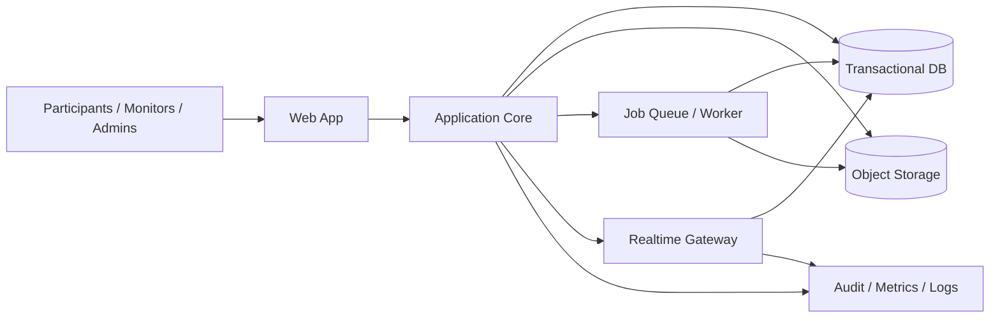
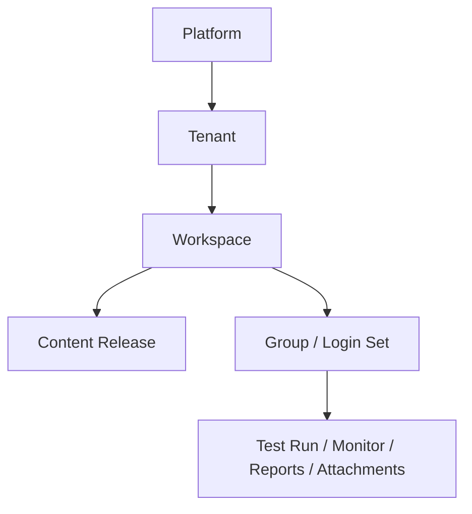
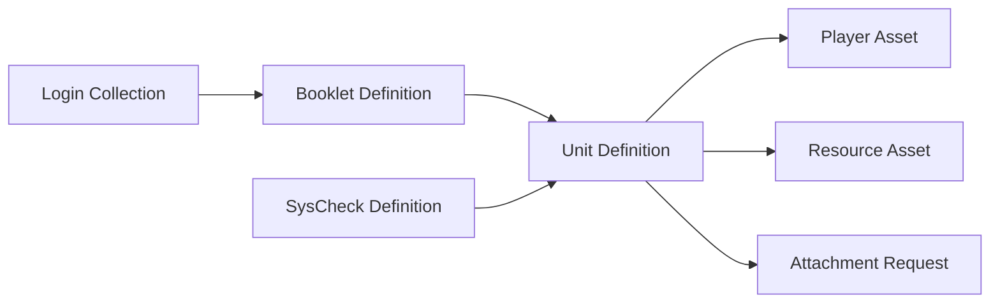
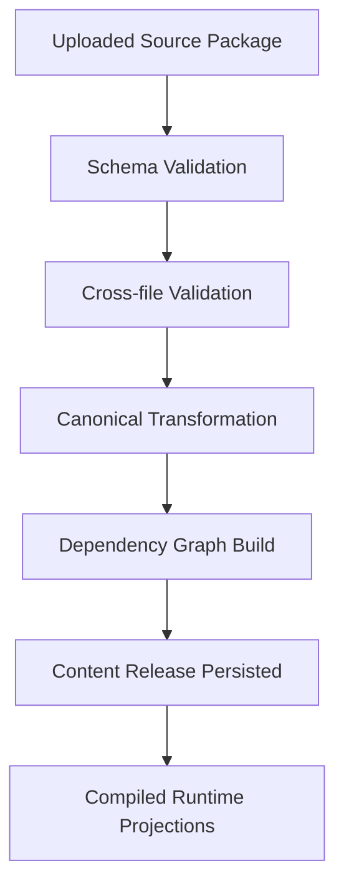

# Testcenter Rewrite Target Architecture

## Purpose

This document turns the rewrite decisions into a target architecture.

It assumes:

- full `v1 parity` for attachments
- full `v1 parity` for system check
- XML remains supported as an input contract
- a new canonical internal content format is introduced
- the platform is designed for multi-tenant operation from day one

This document is intentionally product-first and architecture-first. It does not lock us into a programming language or framework yet.

## Executive Summary

The rewrite should be a **tenant-aware modular monolith** with:

- one coherent application domain
- one canonical content model
- one transactional database
- object storage for content, uploads, exports, and generated assets
- background jobs for imports and exports
- built-in realtime support for monitoring and control

The core mistake to avoid is rebuilding the current system as another set of separate technical silos. The new system should instead revolve around stable business modules:

1. platform and tenant administration
2. identity and access
3. content ingestion and canonicalization
4. delivery runtime
5. monitoring and control
6. reporting and exports
7. attachments
8. system check
9. instance and tenant configuration
10. audit and observability

## Architecture Goals

- preserve the existing product contract where it matters
- reduce operational complexity compared to the current multi-service split
- support institutional multi-tenancy without redesign later
- make content import safer, clearer, and more evolvable
- support controlled migration from legacy to rewrite
- keep high-trust operator features first-class

## Non-Goals For V1

- inventing a new authoring tool before the runtime is stable
- removing XML ingestion
- optimizing for local non-Docker development first
- adding many new end-user features unrelated to parity or usability

## Recommended System Shape

### High-Level Topology

### Runtime Recommendation

- one deployable application codebase for primary business logic
- separate process roles if needed:
  - web/API
  - worker
  - realtime gateway
- one main relational database
- one object storage system
- one cache/pubsub layer only if justified by realtime or scale

This still gives clean operational boundaries without forcing separate codebases and separate domain models.

## Bounded Contexts

### 1. Platform And Tenant Administration

Responsibilities:

- platform-level administration
- tenant provisioning
- tenant lifecycle
- tenant-level branding and governance
- tenant-level limits, quotas, and feature flags

Owns:

- `Tenant`
- `TenantDomain`
- `TenantSettings`
- `TenantBranding`
- `TenantFeatureFlags`

### 2. Identity And Access

Responsibilities:

- admin authentication
- participant login flows
- claim issuance
- session lifecycle
- password reset and security policies
- role mapping across tenant, workspace, monitor, and participant scopes

Owns:

- `User`
- `AdminAccount`
- `ParticipantLogin`
- `AuthSession`
- `AccessGrant`
- `RoleAssignment`
- `SecurityPolicy`

### 3. Content Ingestion And Canonicalization

Responsibilities:

- ingest XML packages and future formats
- validate schemas and semantic constraints
- build dependency graph
- transform source artifacts into canonical content entities
- produce human-readable validation reports

Owns:

- `SourcePackage`
- `ImportedArtifact`
- `ImportJob`
- `ValidationReport`
- `CanonicalizationRun`

### 4. Content Registry

Responsibilities:

- store canonical content definitions
- version content releases per workspace
- track relationships between units, booklets, players, resources, logins, and system checks
- provide compiled runtime projections

Owns:

- `ContentRelease`
- `UnitDefinition`
- `BookletDefinition`
- `BookletNode`
- `BookletStateMachine`
- `PlayerAsset`
- `ResourceAsset`
- `LoginCollection`
- `GroupDefinition`
- `LoginDefinition`
- `SysCheckDefinition`
- `AttachmentRequestDefinition`

### 5. Delivery Runtime

Responsibilities:

- participant startup flow
- test launch
- player hosting contract
- runtime policy enforcement
- autosave
- resume
- mode handling
- adaptive progression

Owns:

- `TestRun`
- `RunModePolicy`
- `UnitAttempt`
- `ResponseEnvelope`
- `UnitStateSnapshot`
- `TestStateSnapshot`
- `NavigationDecision`
- `AdaptiveTransition`

### 6. Monitoring And Control

Responsibilities:

- realtime session updates
- group monitor projections
- study monitor projections
- command dispatch
- command acknowledgements
- websocket/polling fallback

Owns:

- `MonitorSessionView`
- `StudyMonitorView`
- `MonitorProfile`
- `MonitorFilter`
- `OperatorCommand`
- `CommandResult`

### 7. Reporting And Exports

Responsibilities:

- response exports
- log exports
- review exports
- system-check report exports
- detailed inspection endpoints
- data deletion workflows

Owns:

- `ExportJob`
- `ExportArtifact`
- `ReportTemplate`
- `ResultSummary`
- `DeletionRequest`

### 8. Attachments

Responsibilities:

- requested attachment definitions
- attachment listing and review
- upload/download/delete
- QR and generated page workflows
- capture-image support

Owns:

- `AttachmentSlot`
- `AttachmentInstance`
- `AttachmentAsset`
- `AttachmentPageTemplate`
- `AttachmentBatch`

### 9. System Check

Responsibilities:

- system-check definitions
- questionnaire flow
- network checks
- embedded unit execution
- report submission
- admin reporting summaries

Owns:

- `SysCheckRun`
- `SysCheckQuestion`
- `SysCheckAnswerSet`
- `NetworkCheckResult`
- `SysCheckReport`

### 10. Configuration, Branding, And Text Customization

Responsibilities:

- custom texts
- maintenance banners
- logos and themes
- legal notice and intro HTML
- workspace or tenant overrides

Owns:

- `TextBundle`
- `BrandingProfile`
- `WarningBanner`
- `LegalNotice`
- `ThemeProfile`

### 11. Audit And Observability

Responsibilities:

- audit history
- admin event log
- import logs
- command traces
- security events
- application metrics

Owns:

- `AuditEvent`
- `SecurityEvent`
- `OperationalEvent`
- `ImportTrace`

## Tenant Model

### Core Rule

Every primary business object belongs to exactly one tenant.

### Hierarchy

### Recommended Isolation Rules

- every row in the transactional database carries `tenant_id`
- every object storage path starts with `tenant_id`
- every cache key and queue topic includes `tenant_id`
- auth tokens include tenant context
- audits and metrics are queryable by tenant
- admin APIs always execute in a tenant scope unless explicitly platform-level

### Admin Roles

- `platform_admin`
  - provisions tenants
  - sees platform-wide operations
- `tenant_admin`
  - manages tenant settings, admins, branding, and high-level governance
- `workspace_admin`
  - manages workspace content, exports, and workspace operators
- `group_monitor`
  - monitors and controls sessions within authorized group scopes
- `study_monitor`
  - sees aggregated workspace or study progress
- `participant`
  - executes tests or system checks

## Canonical Content Model

### Why We Need It

Right now XML files are effectively part content, part runtime contract, part validation model, and part storage model. That coupling makes the system brittle.

The rewrite should ingest XML but transform it into a **canonical content graph** that becomes the runtime source of truth.

### Proposed Canonical Layers

1. `Source Layer`
   - exact XML and related uploaded artifacts
2. `Canonical Layer`
   - normalized versioned entities used by the app
3. `Compiled Runtime Layer`
   - projections optimized for delivery, monitoring, and exports

### Canonical Entity Sketch

#### UnitDefinition

- `unit_id`
- `title`
- `player_asset_id`
- `definition_ref` or embedded definition payload
- `player_dependencies`
- `coding_scheme_ref`
- `attachment_requests`
- `metadata`

#### BookletDefinition

- `booklet_id`
- `title`
- `nodes`
- `blocks`
- `unit references`
- `aliases`
- `labels`
- `runtime_config`
- `state_machine`
- `adaptivity_rules`

#### LoginCollection

- `collection_id`
- `groups`
- `logins`
- `modes`
- `booklet assignments`
- `codes`
- `validity windows`
- `custom_text_overrides`
- `monitor profiles`

#### SysCheckDefinition

- `syscheck_id`
- `title`
- `description`
- `save_key`
- `embedded_unit_id`
- `questionnaire`
- `network_policy`
- `custom_text_overrides`

#### AttachmentRequestDefinition

- `slot_id`
- `unit_id`
- `variable_id`
- `attachment_type`
- `presentation metadata`

### Canonical Relationship Graph

### Canonical Import Pipeline

### Important Design Choice

The platform should store both:

- original source artifacts for traceability
- canonical entities for actual business behavior

That lets us:

- compare canonical releases across imports
- show precise validation errors
- support future non-XML authoring formats
- maintain XML compatibility without XML-shaped internals

## Storage Model

### Transactional Database

Use the relational database for:

- tenants
- users and sessions
- canonical content metadata and relationships
- runtime state
- monitor views
- command history
- export jobs
- audits

### Object Storage

Use object storage for:

- original uploads
- player assets
- resource assets
- generated exports
- attachment files
- generated PDFs and batches
- import artifacts and traces if large

### Cache / PubSub

Use sparingly for:

- websocket fanout
- short-lived monitor projections
- throttled import/export status

It should not become a second database of record.

## Runtime And Realtime Design

### Participant Runtime

The participant app should talk to one coherent API for:

- login/session status
- test launch
- unit payloads
- state persistence
- command fetch/ack

The player hosting contract can still use a dedicated runtime component inside the app, but not as a separate business system.

### Realtime Monitoring

Recommended approach:

- websocket as primary transport
- polling fallback for degraded environments
- monitor projections built from runtime events and persisted snapshots

The key is not websocket vs polling. The key is having one event model:

- `run_started`
- `unit_entered`
- `state_updated`
- `response_saved`
- `run_paused`
- `command_sent`
- `command_acknowledged`
- `run_terminated`
- `connection_lost`

## API Shape

The rewrite should preserve core legacy capabilities, but not necessarily legacy route shapes one-to-one.

Recommended API families:

- `/platform/*`
- `/tenants/*`
- `/workspaces/*`
- `/imports/*`
- `/content-releases/*`
- `/sessions/*`
- `/runs/*`
- `/monitor/*`
- `/study-monitor/*`
- `/exports/*`
- `/attachments/*`
- `/sys-check/*`
- `/settings/*`
- `/audit/*`

Compatibility adapters can preserve old routes where migration risk is high.

## Suggested UI Applications

### 1. Participant App

- login
- starter
- test runtime
- system check

### 2. Operations App

- group monitor
- study monitor
- attachments
- exports

### 3. Administration App

- tenant settings
- workspace content admin
- users and access
- branding and custom texts
- audit view

These can share one frontend codebase if the routing and module boundaries stay clean.

## Migration Strategy

### Phase 0. Contract Capture

- freeze legacy behavior through acceptance tests
- capture export golden files
- define XML compatibility fixtures
- define monitor command parity fixtures

### Phase 1. Platform Foundation

- tenant model
- identity model
- workspace model
- object storage
- audit infrastructure
- platform and tenant admin skeleton

### Phase 2. Import And Content Registry

- source package uploads
- XML validation
- canonical transformation
- dependency graph
- immutable content releases
- workspace activation of a content release

### Phase 3. Participant Access And Runtime

- all login variants
- starter flow
- launch runtime
- save/resume
- mode engine
- booklet config enforcement
- adaptivity

### Phase 4. Monitoring

- realtime event pipeline
- group monitor
- monitor profiles and filters
- command dispatch and acknowledgements
- study monitor summaries

### Phase 5. Reporting And Review

- response/log/review exports
- detailed inspection
- deletion workflows
- review UI parity

### Phase 6. System Check And Attachments

- full sys-check flow
- report submission
- admin summaries
- requested attachment model
- capture-image
- generated pages and batches

### Phase 7. Tenant Configuration And Hardening

- branding
- custom texts
- warning banners
- legal notice
- theming
- permission hardening
- multi-tenant observability

### Phase 8. Parallel Run And Cutover

- import same workspace into legacy and rewrite
- compare exports
- compare monitor behavior
- shadow selected tenants
- migrate tenant by tenant

## Cutover Strategy

Recommended cutover unit: **tenant**, not global platform.

Why:

- cleaner rollback boundary
- easier support and communication
- aligns with multi-tenant design
- lets us run pilot tenants before general migration

For each tenant:

1. import and validate workspaces
2. run export parity checks
3. run operator acceptance checks
4. cut traffic for selected workspaces
5. monitor closely
6. retire legacy usage after stabilization

## Key Architectural Risks

### 1. XML Semantics Drift During Transformation

Mitigation:

- golden fixtures
- side-by-side canonical diff tooling
- import trace with source-to-canonical mapping

### 2. Realtime Behavior Drift In Monitoring

Mitigation:

- command and session event contract tests
- persisted monitor snapshots
- polling fallback from the start

### 3. Multi-Tenant Leakage

Mitigation:

- tenant_id everywhere
- automated authorization tests
- storage path conventions
- audit events for admin access

### 4. Export Parity Breakage

Mitigation:

- golden file tests
- fixture workspaces
- explicit semantic spec for each export type

### 5. Attachments And System Check Complexity

Mitigation:

- treat them as first-class bounded contexts
- do not delay their domain modeling
- include them in v1 acceptance criteria early

## Delivery Recommendation

If we keep discipline, the rewrite should be organized around these workstreams:

1. platform and tenancy
2. canonical import and content registry
3. participant runtime
4. monitoring and realtime
5. reporting, system check, and attachments
6. admin UX and configuration

The next planning artifact should convert this into:

- a module map
- a canonical data model
- an implementation roadmap by milestone
- a risk-based test strategy
